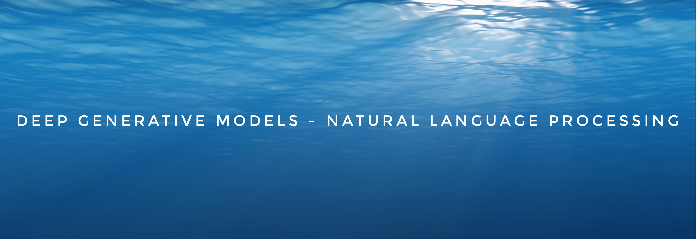

DGMs 4 NLP. Deep Generative Models for Natural Language Processing. A Roadmap. 

Yao Fu, University of Edinburgh, yao.fu@ed.ac.uk

\*\*Update\*\*: [How to write Variational Inference and Generative Models for NLP: a recipe](https://github.com/FranxYao/Deep-Generative-Models-for-Natural-Language-Processing/blob/master/src/VI4NLP_Recipe.pdf). 

\*\*Update\*\*: Re-organized sections, expand NLP section; Semantics, compositionality, optimization for discrete structures

\*\*TODO 1\*\*: Decoding and Search, Efficient Inference; More on gradient estimation and optimization for discrete structures

\*\*TODO 2\*\*: Matrix Factorization; Kernels; Non-autoregressive Generation; Score-based Generative Models; A* sampling; Contrastive Divergence; EBM; Langevin Dynamics; Invariance and identifiability

----

Why do we want deep generative models? Because we want to learn the latent representations for language. Human language contains rich latent factors, the continuous ones might be emotion, intention, and others, the discrete/ structural factors might be POS/ NER tags or syntax trees. They are latent since we just observe the sentence. They are also generative: human should produce language based on the overall idea, the current emotion, the syntax, and all other things we can or cannot name. 

How to model them in a statistically principled way? Can we have a flexible framework that allows us to incorporate explicit supervision signals when we have labels, or add distant supervision or logical/ statistical constraints when we do not have labels but have other prior knowledge, or simply infer whatever makes the most sense when we have no labels or a priori? Is it possible that we exploit the modeling power of advanced neural architectures while still being mathematical and probabilistic? DGMs allow us to achieve these goals. 

Let us begin the journey. 

(This list originated from the [DGM seminar at Columbia](http://stat.columbia.edu/~cunningham/teaching/GR8201/) then extended this far)

### Table of Content 
* [Resources](#resources)
  * [DGM Seminars](#DGM-Seminars)
  * [Courses](#Courses)
  * [Books](#Books)
* [NLP Side](#nlp-side)
  * [Generation](#Generation)
  * [Decoding and Search](#Decoding-and-Search)
  * [Structured Prediction](#Structured-Prediction)
  * [Syntax](#Syntax)
  * [Semantics](#Semantics)
  * [Compositionality](#Compositionality)
* [ML Side](#ml-side)
  * [Samplig Methods](#Samplig-Methods)
  * [Variational Inference](#Variational-Inference,-VI)
  * [VAEs](#VAEs)
  * [Reparameterization](#Reparameterization)
  * [GANs](#GANs)
  * [Flows](#Flows)
* [Advanced Topics](#Advanced-Topics)
  * [Neural Architextures](#Neural-Architectures)
    * [RNNs](#RNNs)
    * [Transformers](#Transformers)
  * [Optimization](#Optimization)
    * [Gradient Estimation](#Gradient-Estimation)
    * [Discrete Structures](#Discrete-Structures)
  * [Inference](#Inference)
    * [Efficient Inference](#Efficient-Inference)
    * [Structured Family](#Structured-Family)
    * [Posterior Regularization](#Posterior-Regularization)
  * [Representation](#Representation)
    * [Information Theory](#Information-Theory)
    * [Disentanglement and Interpretability](#Disentanglement-and-Interpretability)
    * [Invariance](#Invariance)
  * [Analysis and Critics](#Analysis-and-Critics)
* [Applications](#Applications)

Citation:
```
@article{yao2019DGM4NLP,
  title   = "Deep Generative Models for Natual Language Processing",
  author  = "Yao Fu",
  year    = "2018",
  url     = "https://github.com/FranxYao/Deep-Generative-Models-for-Natural-Language-Processing"
}
```

## Resources 

### DGM Seminars

* ♦︎ John's DGM: Columbia STAT 8201, [Deep Generative Models](http://stat.columbia.edu/~cunningham/teaching/GR8201/), by [John Cunningham](https://stat.columbia.edu/~cunningham/)
  * The DGM seminar at Columbia. The first part of this course focuses on VAEs and the second part focuses on GANs. 
  * The discussion about [wesserstein GANs](http://stat.columbia.edu/~cunningham/teaching/GR8201/STAT_GR8201_2019_SPRG_slides_lec12.pdf) is amazing. Do take a look. 

* ♦︎ Sasha's tutorial: A Tutorial on Deep Latent Variable Models of Natural Language ([link](https://arxiv.org/abs/1812.06834)), EMNLP 18 
  * Yoon Kim, Sam Wiseman and Alexander M. Rush, Havard

* Wilker Aziz's [DGM Landscape](http://wilkeraziz.github.io/pages/landscape) and their [tutorial](https://github.com/vitutorial/VITutorial)
  * A great guidebook for VI. A graph over the VI literature and discusses the connections of different techniques. 

* Stanford CS 236, Deep Generative Models ([link](https://deepgenerativemodels.github.io/))

* NYU Deep Generative Models ([link](https://cs.nyu.edu/courses/spring18/CSCI-GA.3033-022/))

* U Toronto [CS 2541](https://www.cs.toronto.edu/~duvenaud/courses/csc2541/index.html) Differentiable Inference and Generative Models, [CS 2547](https://duvenaud.github.io/learn-discrete/) Learning Discrete Latent Structures.  

* Berkeley [CS294-158](https://sites.google.com/view/berkeley-cs294-158-sp19/home) Deep Unsupervised Learning.

* Columbia [STCS 8101](http://www.cs.columbia.edu/~blei/seminar/2020-representation/index.html) Representation Learning: A Probabilistic Perspective

### Courses

The fundation of the DGMs is built upon probabilistic graphical models. So we take a look at the following resources

* Blei's Foundation of Graphical Models course, STAT 6701 at Columbia ([link](http://www.cs.columbia.edu/~blei/fogm/2019F/index.html))
  * Foundation of probabilistic modeling, graphical models, and approximate inference. 

* Xing's Probabilistic Graphical Models, 10-708 at CMU ([link](https://sailinglab.github.io/pgm-spring-2019/))
  * A really heavy course with extensive materials.
  * 5 modules in total: exact inference, approximate inference, DGMs, reinforcement learning, and non-parameterics. 
  * All the lecture notes, vedio recordings, and homeworks are open-sourced. 

* ♦︎ Collins' Natural Language Processing, COMS 4995 at Columbia ([link](http://www.cs.columbia.edu/~mcollins/cs4705-spring2019/))
  * Many inference methods for structured models are introduced. Also take a look at related notes from [Collins' homepage](http://www.cs.columbia.edu/~mcollins/)
  * Also checkout [bilibili](https://www.bilibili.com/video/av29608234?from=search&seid=10252913399572988135)

### Books

* Pattern Recognition and Machine Learning. Christopher M. Bishop. 2006
  * Probabily the most classical textbook 
  * The _core part_, according to my own understanding, of this book, should be section 8 - 13, especially section 10 since this is the section that introduces variational inference. 

* Machine Learning: A Probabilistic Perspective. Kevin P. Murphy. 2012
  * Compared with the PRML Bishop book, this book may be used as a super-detailed handbook for various graphical models and inference methods. 

* Graphical Models, Exponential Families, and Variational Inference. 2008
  * Martin J. Wainwright and Michael I. Jordan

* Linguistic Structure Prediction. 2011
  * Noah Smith 

* The Syntactic Process. 2000 
  * Mark Steedman

----


## NLP Side 

We will focus on two topics: generation and structural inference, and the advanced neural network architectures for them. We start from generation

### Generation

* ♦︎ Generating Sentences from a Continuous Space, CoNLL 15
  * Samuel R. Bowman, Luke Vilnis, Oriol Vinyals, Andrew M. Dai, Rafal Jozefowicz, Samy Bengio
  * Seems to be the first paper using VAEs for NLP
  * An important point of this paper is about the posterior collapse problems, which has many follow-ups

* Neural variational inference for text processing, ICML 16 
  * Yishu Miao, Lei Yu, Phil Blunsom, Deepmind

* Learning Neural Templates for Text Generation. EMNLP 2018 
  * Sam Wiseman, Stuart M. Shieber, Alexander Rush. Havard 

* Residual Energy Based Models for Text Generation. ICLR 20
  * Yuntian Deng, Anton Bakhtin, Myle Ott, Arthur Szlam, Marc' Aurelio Ranzato. Havard and FAIR

* ♦︎ Cascaded Text Generation with Markov Transformers. Arxiv 20
  * Yuntian Deng and Alexander Rush

* Paraphrase Generation with Latent Bag of Words. NeurIPS 2019.
  * Yao Fu, Yansong Feng, and John P. Cunningham. Columbia 
  * Learning bag of words as discrete latent variables, differentiable subset sampling via gumbel-topk reparameterization. 

* ♦︎ Stochastic Beams and Where to Find Them: The Gumbel-Top-k Trick for Sampling Sequences Without Replacement. ICML 19
  * Wouter Kool, Herke van Hoof, Max Welling
  * Gumbel topk, stochastic differentiable beam search 

### Decoding and Search

TBC 

### Structured Prediction

* ♦︎♦︎ Torch-Struct: Deep Structured Prediction Library
  * Alexander M. Rush. Cornell University 
  * [github](https://github.com/harvardnlp/pytorch-struct), [paper](https://arxiv.org/abs/2002.00876), [documentation](http://nlp.seas.harvard.edu/pytorch-struct/)
  * Instantiate different CRFs with different Semirings. The backward part of inference algorithms are implemented with Autograd. Sasha implmented all these stuff alone, including the CUDA codes. 

* Latent Structure Models for NLP. ACL 2019 tutorial [link](https://deep-spin.github.io/tutorial/)
  * André Martinns, Tsvetomila Mihaylova, Nikita Nangia, Vlad Niculae.

* ♦︎ An introduction to Conditional Random Fields. Charles Sutton and Andrew McCallum. 2012 
  * Linear-chain CRFs. Modeling, inference and parameter estimation

* ♦︎ Inside-Outside and Forward-Backward Algorithms Are Just Backprop. Jason Eisner. 2016. 
  * The relationships between CRF inference and Autograd. 

* ♦︎ Structured Attention Networks. ICLR 2017 
  * Yoon Kim, Carl Denton, Luong Hoang, Alexander M. Rush
  * Structured attention w. linear chain and tree crfs. 

* Differentiable Dynamic Programming for Structured Prediction and Attention. Arthur Mensch and Mathieu Blondel. ICML 2018 
  * To differentiate the max operator in dynamic programming. 


### Syntax

* Recurrent Neural Network Grammars. NAACL 16
  * Chris Dyer, Adhiguna Kuncoro, Miguel Ballesteros, and Noah Smith.
  * A transaction based generative model to model the joint prob of trees and sentences. 
  * Inference: use importance sampling to calculate the sentence marginal prob. Use the discriminative model as the proposal dist. 

* Unsupervised Recurrent Neural Network Grammars, NAACL 19 
  * Yoon Kin, Alexander Rush, Lei Yu, Adhiguna Kuncoro, Chris Dyer, and Gabor Melis

* Differentiable Perturb-and-Parse: Semi-Supervised Parsing with a Structured Variational Autoencoder, ICLR 19
  * Caio Corro, Ivan Titov, Edinburgh
  * Reparameterize the sampling from a CRF by using gumbel perturbation and continuous relexation of Eisner Algo. 


### Semantics

* The Syntactic Process. 2020 
  * Mark Steedman

* Linguistically-Informed Self-Attention for Semantic Role Labeling. EMNLP 2018 Best paper award
  * Emma Strubell, Patrick Verga, Daniel Andor, David Weiss and Andrew McCallum. UMass Amherst and Google AI Language

* Semantic Parsing with Semi-Supervised Sequential Autoencoders. 2016
  * Tomas Kocisky, Gabor Melis, Edward Grefenstette, Chris Dyer, Wang Ling, Phil Blunsom, Karl Moritz Hermann

### Compositionality

* Generalization without Systematicity: On the Compositional Skills of Sequence-to-Sequence Recurrent Networks. ICML 2019
  * Brenden Lake and Marco Baroni 

* Improving Text-to-SQL Evaluation Methodology. ACL 2018 
  * Catherine Finegan-Dollak, Jonathan K. Kummerfeld, Li Zhang, Karthik Ramanathan, Sesh Sadasivam, Rui Zhang, Dragomir Radev

* Span-based Semantic Parsing for Compositional Generalization. 2020 
  * Jonathan Herzig, Jonathan Berant

----

## ML Side 


### Samplig Methods

* ♦︎ Probabilistic inference using Markov chain Monte Carlo methods. 1993 
  * Radford M Neal 
  * Markov Chains; Gibbs Sampling; Metropolis-Hastings 

* Elements of Sequential Monte Carlo ([link](https://arxiv.org/abs/1903.04797))
  * Christian A. Naesseth, Fredrik Lindsten, Thomas B. Schön

* A Conceptual Introduction to Hamiltonian Monte Carlo ([link](https://arxiv.org/abs/1701.02434))
  * Michael Betancourt

* Candidate Sampling ([link](https://www.tensorflow.org/extras/candidate_sampling.pdf))
  * Google Tensorflow Blog

* Noise-constrastive estimation: A new estimation principle for unnormalized statistical models. AISTATA 2010 
  * Michael Gutmann, Hyvarinen. University of Helsinki

* ♦︎ A* Sampling. NIPS 2014 Best paper award
  * Chris J. Maddison, Daniel Tarlow, Tom Minka. University of Toronto and MSR


### Variational Inference, VI 

* ♦︎ Cambridge Variational Inference Reading Group ([link](http://www.statslab.cam.ac.uk/~sp825/vi.html))
  * Sam Power. University of Cambridge 

* ♦︎ Variational Inference: A Review for Statisticians. 
  * David M. Blei, Alp Kucukelbir, Jon D. McAuliffe. 
  * Mean-field variational family; coordinate ascent algorithm; bayesian mixture of gaussians; VI w. exponential families. 

* Stochastic Variational Inference
  * Matthew D. Hoffman, David M. Blei, Chong Wang, John Paisley
  * Natural gradient of the ELBO; stochastic optimization; bayesian non-parameterics for the hierarchical dirichlet process. 

* Variational Bayesian Inference with Stochastic Search. ICML 12
  * John Paisley, David Blei, Michael Jordan. Berkeley and Princeton 


### VAEs 

* ♦︎ Auto-Encoding Variational Bayes, ICLR 14
  * Diederik P. Kingma, Max Welling

* Stochastic Backpropagation and Approximate Inference in Deep Generative Models. ICML 14
  * Danilo Jimenez Rezende, Shakir Mohamed, Daan Wierstra
  * Reparameterization w. deep gaussian models. 

* Semi-amortized variational autoencoders, ICML 18 
  * Yoon Kim, Sam Wiseman, Andrew C. Miller, David Sontag, Alexander M. Rush, Havard

* Adversarially Regularized Autoencoders, ICML 18 
  * Jake (Junbo) Zhao, Yoon Kim, Kelly Zhang, Alexander M. Rush, Yann LeCun. NYU, Havard, FAIR
  * A wrapup of the major VAE/ GANs 
  * The presentation of [this paper](src/annotated_arae.pdf) at the Columbia DGM seminar course. 


### Reparameterization 
More on reparameterization: to reparameterize gaussian mixture, permutation matrix, and rejection samplers(Gamma and Dirichlet).   

* Stochastic Backpropagation through Mixture Density Distributions, Arxiv 16
  * Alex Graves
  * To reparameterize Gaussian Mixture 

* Reparameterization Gradients through Acceptance-Rejection Sampling Algorithms. AISTATS 2017 
  * Christian A. Naesseth, Francisco J. R. Ruiz, Scott W. Linderman, David M. Blei

* Implicit Reparameterization Gradients. NeurIPS 2018. 
  * Michael Figurnov, Shakir Mohamed, and Andriy Mnih
  * Really smart way to reparameterize many complex distributions.

* Categorical Reparameterization with Gumbel-Softmax. ICLR 2017 
  * Eric Jang, Shixiang Gu, Ben Poole

* ♦︎ The Concrete Distribution: A Continuous Relaxation of Discrete Random Variables. ICLR 2017 
  * Chris J. Maddison, Andriy Mnih, and Yee Whye Teh

* Invertible Gaussian Reparameterization:  Revisiting the Gumbel-Softmax. 2020
  *  Andres Potapczynski, Gabriel Loaiza-Ganem, John P. Cunningham 

* Reparameterizable Subset Sampling via Continuous Relaxations. IJCAI 2019 
  * Sang Michael Xie and Stefano Ermon


### GANs

* Generative Adversarial Networks, NIPS 14
  * Ian J. Goodfellow, Jean Pouget-Abadie, Mehdi Mirza, Bing Xu, David Warde-Farley, Sherjil Ozair, Aaron Courville, Yoshua Bengio
  * GAN origin 
  * This original GAN paper use the KL divergence to measure the distance between probability distributions, which may lead to the vanishing of gradient. To tackle this problem, the wassertein GAN is proposed with the earch mover distance. The following two papers shows the birth of wGAN.

* Towards principled methods for training generative adversarial networks, ICLR 2017 
  * Martin Arjovsky and Leon Bottou
  * Discusses the distance between distributions, but uses many hacky methods.

* ♦︎ Wasserstein GAN 
  * Martin Arjovsky, Soumith Chintala, Léon Bottou
  * The principled methods, born from hacky methods. 

* InfoGAN: Interpretable Representation Learning by Information Maximizing Generative Adversarial Nets. NIPS 2016
  * Xi Chen, Yan Duan, Rein Houthooft, John Schulman, Ilya Sutskever, Pieter Abbeel. UC Berkeley. OpenAI
  * Variational mutual information maximization; unsupervised disentangled representation learning. 


### Flows

* ♦︎ Flow Based Deep Generative Models, from [Lil's log](https://lilianweng.github.io/lil-log/2018/10/13/flow-based-deep-generative-models.html) 

* Variational Inference with Normalizing Flows, ICML 15 
  * Danilo Jimenez Rezende, Shakir Mohamed

* Improved Variational Inference with Inverse Autoregressive Flow
  * Diederik P Kingma, Tim Salimans, Rafal Jozefowicz, Xi Chen, Ilya Sutskever, Max Welling

* Density estimation using Real NVP. ICLR 17 
  * Laurent Dinh, Jascha Sohl-Dickstein, Samy Bengio

* Learning About Language with Normalizing Flows 
  * Graham Neubig, CMU, [slides](http://www.phontron.com/slides/neubig19generative.pdf)

* Latent Normalizing Flows for Discrete Sequences. ICML 2019. 
  * Zachary M. Ziegler and Alexander M. Rush

* Discrete Flows: Invertible Generative Models of Discrete Data. 2019 
  * Dustin Tran, Keyon Vafa, Kumar Krishna Agrawal, Laurent Dinh, Ben Poole

* Variational Neural Machine Translation with Normalizing Flows. ACL 2020 
  * Hendra Setiawan, Matthias Sperber, Udhay Nallasamy, Matthias Paulik. Apple 


----
## Advanced Topics

### Neural Architectures

* THUNLP: Pre-trained Languge Model paper list ([link](https://github.com/thunlp/PLMpapers))
  * Xiaozhi Wang and Zhengyan Zhang, Tsinghua University 

#### RNNs

* Ordered Neurons: Integrating Tree Structured into Recurrent Neural Networks
  * Yikang Shen, Shawn Tan, Alessandro Sordoni, Aaron Courville. Mila, MSR

* RNNs can generate bounded hierarchical languages with optimal memory
  * John Hewitt, Michael Hahn, Surya Ganguli, Percy Liang, Christopher D. Manning

#### Transformers

* Long Range Arena: A Benchmark for Efficient Transformers
  * Yi Tay, Mostafa Dehghani, Samira Abnar, Yikang Shen, Dara Bahri, Philip Pham, Jinfeng Rao, Liu Yang, Sebastian Ruder, Donald Metzler

* Analyzing Multi-Head Self-Attention: Specialized Heads Do the Heavy Lifting, the Rest Can Be Pruned. ACL 2019
  * Elena Voita, David Talbot, Fedor Moiseev, Rico Sennrich, Ivan Titov

* Theoretical Limitations of Self-Attention in Neural Sequence Models. TACL 2019
  * Michael Hahn

* Rethinking Attention with Performers. 2020
  * Krzysztof Choromanski, Valerii Likhosherstov, David Dohan, Xingyou Song, Andreea Gane, Tamas Sarlos, Peter Hawkins, Jared Davis, Afroz Mohiuddin, Lukasz Kaiser, David Belanger, Lucy Colwell, Adrian Weller

### Optimization

#### Gradient Estimation

* ♦︎ Monte Carlo Gradient Estimation in Machine Learning 
  * Schakir Mohamed, Mihaela Rosca, Michael Figurnov, Andriy Mnih. DeepMind

* Variational Inference for Monte Carlo Objectives. ICML 16
  * Andriy Mnih,  Danilo J. Rezende. DeepMind

* REBAR: Low-variance, unbiased gradient estimates for discrete latent variable models. NIPS 17
  * George Tucker, Andriy Mnih, Chris J. Maddison, Dieterich Lawson, Jascha Sohl-Dickstein. Google Brain, DeepMind, Oxford

* ♦︎ Backpropagation Through the Void: Optimizing Control Variates for Black-box Gradient Estimation. ICLR 18
  * Will Grathwohl, Dami Choi, Yuhuai Wu, Geoffrey Roeder, David Duvenaud. U Toronto and Vector Institute
  
* Backpropagating through Structured Argmax using a SPIGOT. ACL 2018 Best Paper Honorable Mention. 
  * Hao Peng, Sam Thomson, and Noah A. Smith
  
* Understanding the Mechanics of SPIGOT: Surrogate Gradients for Latent Structure Learning. EMNLP 2020 
  * Tsvetomila Mihaylova, Vlad Niculae, and Andre ́ F. T. Martins


#### Discrete Structures

* Learning with Differentiable Perturbed Optimizers. NeurIPS 2020
  * Quentin Berthet, Mathieu Blondel, Olivier Teboul, Marco Cuturi, Jean-Philippe Vert, Francis Bach

* Gradient Estimation with Stochastic Softmax Tricks. NeurIPS 2020 
  * Max B. Paulus, Dami Choi, Daniel Tarlow, Andreas Krause, Chris J. Maddison. 

* Differentiable Dynamic Programming for Structured Prediction and Attention. ICML 18 
  * Arthur Mensch, Mathieu Blondel. Inria Parietal and NTT Communication Science Laboratories 

* Stochastic Optimization of Sorting Networks via Continuous Relaxations
  * Aditya Grover, Eric Wang, Aaron Zweig, Stefano Ermon

* Differentiable Ranks and Sorting using Optimal Transport
  * Guy Lorberbom, Andreea Gane, Tommi Jaakkola, and Tamir Hazan

* Reparameterizing the Birkhoff Polytope for Variational Permutation Inference. AISTATS 2018 
  * Scott W. Linderman, Gonzalo E. Mena, Hal Cooper, Liam Paninski, John P. Cunningham. 

* A Regularized Framework for Sparse and Structured Neural Attention. NeurIPS 2017

* SparseMAP: Differentiable Sparse Structured Inference. ICML 2018


### Inference

#### Efficient Inference

* Nested Named Entity Recognition with Partially-Observed TreeCRFs. AAAI 2021
  * Yao Fu, Chuanqi Tan, Mosha Chen, Songfang Huang, Fei Huang

* Rao-Blackwellized Stochastic Gradients for Discrete Distributions. ICML 2019.
  * Runjing Liu, Jeffrey Regier, Nilesh Tripuraneni, Michael I. Jordan, Jon McAuliffe

* Efficient Marginalization of Discrete and Structured Latent Variables via Sparsity. NeurIPS 2020 
  * Gonçalo M. Correia, Vlad Niculae, Wilker Aziz, André F. T. Martins

#### Structured Family

TBC 

#### Posterior Regularization 

* Posterior Regularization for Structured Latent Variable Models
  * Kuzman Ganchev, João Graça, Jennifer Gillenwater, Ben Taskar. JMLR 2010. 

* Posterior Control of Blackbox Generation 
  * Xiang Lisa Li and Alexander M. Rush. 2019.


### Representation

#### Information Theory 

* ♦︎ Elements of Information Theory. Cover and Thomas. 1991 

* ♦︎ On Variational Bounds of Mutual Information. ICML 2019 
  * Ben Poole, Sherjil Ozair, Aaron van den Oord, Alexander A. Alemi, George Tucker
  * A comprehensive discussion of all these MI variational bounds 

* Learning Deep Representations By Mutual Information Estimation And Maximization. ICLR 2019 
  * R Devon Hjelm, Alex Fedorov, Samuel Lavoie-Marchildon, Karan Grewal, Phil Bachman, Adam Trischler, and Yoshua Bengio
  * A detailed comparison between different MI estimators, section 3.2. 

* MINE: Mutual Information Neural Estimation
  * R Devon Hjelm, Alex Fedorov, Samuel Lavoie-Marchildon, Karan Grewal, Phil Bachman, Adam Trischler, Yoshua Bengio

* Deep Variational Information Bottleneck. ICLR 2017 
* Alexander A. Alemi, Ian Fischer, Joshua V. Dillon, Kevin Murphy. Google Research 


#### Disentanglement and Interpretability

* Identifying Bayesian Mixture Models 
  * Michael Betancourt
  * The source of non-identifiability is symmetry and exchangability in both prior and conditional.
  * Two ways of breaking the symmetry:
    * Ordering of the mixture component
    * non-exchangeable prior 

* Disentangling Disentanglement in Variational Autoencoders. ICML 2019 
  * Emile Mathieu, Tom Rainforth, N. Siddharth, Yee Whye Teh

* Challenging Common Assumptions in the Unsupervised Learning of Disentangled Representations. ICML 2019 
  * Francesco Locatello, Stefan Bauer, Mario Lucic, Gunnar Rätsch, Sylvain Gelly, Bernhard Schölkopf, Olivier Bachem


#### Invariance

* Emergence of Invariance and Disentanglement in Deep Representations
  * Alessandro Achillo and Stefano Soatto. UCLA. JMLR 2018 

* Invariant Risk Minimization
  * Martin Arjovsky, Leon Bottou, Ishaan Gulrajani, David Lopez-Paz. 2019. 


### Analysis and Critics

* Fixing a Broken ELBO. ICML 2018. 
  * Alexander A. Alemi, Ben Poole, Ian Fischer, Joshua V. Dillon, Rif A. Saurous, Kevin Murphy

* Tighter Variational Bounds are Not Necessarily Better. ICML 2018 
  * Tom Rainforth, Adam R. Kosiorek, Tuan Anh Le, Chris J. Maddison, Maximilian Igl, Frank Wood, Yee Whye Teh

* The continuous Bernoulli: fixing a pervasive error in variational autoencoders. NeurIPS 2019 
  * Gabriel Loaiza-Ganem and John P. Cunningham. Columbia. 

* Do Deep Generative Models Know What They Don't Know? ICLR 2019 
  * Eric Nalisnick, Akihiro Matsukawa, Yee Whye Teh, Dilan Gorur, Balaji Lakshminarayanan

* Effective Estimation of Deep Generative Language Models. ACL 2020 
  * Tom Pelsmaeker and Wilker Aziz. University of Edinburgh and University of Amsterdam 


### Applications

TODO: summarization; machine translation; dialog

* Generating Informative and Diverse Conversational Responses via Adversarial Information Maximization, NIPS 18
  * Yizhe Zhang, Michel Galley, Jianfeng Gao, Zhe Gan, Xiujun Li, Chris Brockett, Bill Dolan

* Discovering Discrete Latent Topics with Neural Variational Inference, ICML 17 
  * Yishu Miao, Edward Grefenstette, Phil Blunsom. Oxford

* TopicRNN: A Recurrent Neural Network with Long-Range Semantic Dependency, ICLR 17 
  * Adji B. Dieng, Chong Wang, Jianfeng Gao, John William Paisley

* Topic Aware Neural Response Generation, AAAI 17 
  * Chen Xing, Wei Wu, Yu Wu, Jie Liu, Yalou Huang, Ming Zhou, Wei-Ying Ma


