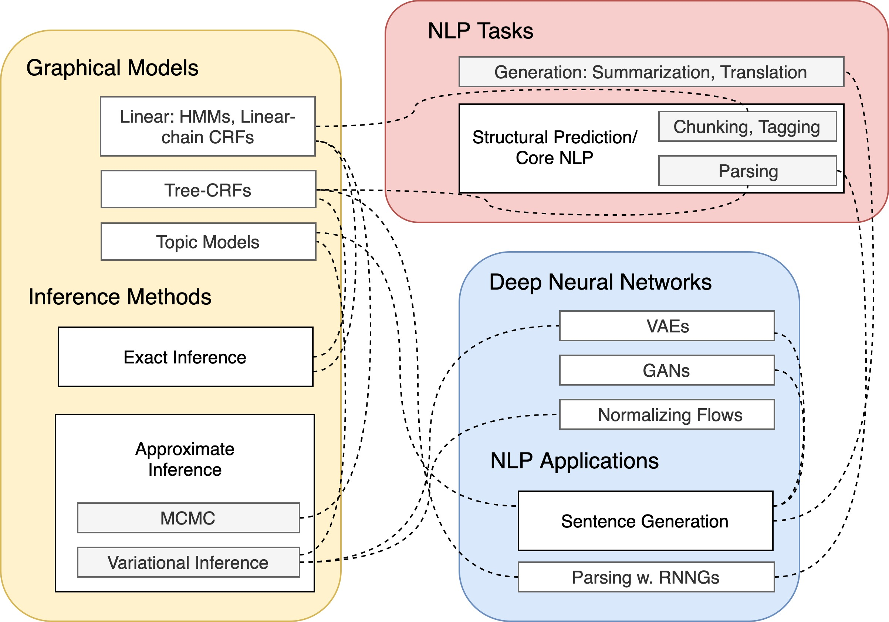

# Deep-Generative-Models-for-Natural-Language-Processing
DGMs 4 NLP, Deep Generative Models for Natural Language Processing, resources, conference mapping and paper list. 

This list is continuously under construction. Some of the papers are not very well organized. I will improve it. Please do send me issues if you have any suggestions (and I'm looking for collaborators!). 

Yao Fu, Columbia University, yao.fu@columbia.edu

----

When talking about deep generative models, one usually refers to three model families: the Variational Autoencoders (VAEs), the Generative Adversarial Networks (GANs), and the Normalizing Flows.

Amoung the three model families, we will focus more on VAEs side since they are more effective. Whether GAN really works is still an open question. The effectiveness of GANs is more like the discriminator's regularization, rather than the 'generative' part. Or correct me if I am wrong.

Many discrete structures are involved in VAE models for NLP. Inference over these structures is tricky and smart. Many of them deserve to know.

## Resources 

### Deep Generative Models

#### Columbia STAT 8201, [Deep Generative Models](http://stat.columbia.edu/~cunningham/teaching/GR8201/), by [John Cunningham](https://stat.columbia.edu/~cunningham/)
* The DGM seminar course I took at Columbia. The first part of this course focus on VAEs and the second part focus on GANs. 
* The discussion about the [relationships between gumbel, uniform, exponential, and categorical](http://stat.columbia.edu/~cunningham/teaching/GR8201/STAT_GR8201_2019_SPRG_slides_lec03.pdf) is interesting, do take a look. 
* The discussion about [wesserstein GANs](http://stat.columbia.edu/~cunningham/teaching/GR8201/STAT_GR8201_2019_SPRG_slides_lec12.pdf) is amazing. Do take a look. 

#### Wilker Aziz's DGM Landscape ([link](http://wilkeraziz.github.io/pages/landscape))
* This is a great guidebook for VI. It is a graph over the VI literature and discuss the connections of different techniques. Definitely go over this to have a rough sense/ go deep about DGMs 

#### A Tutorial on Deep Latent Variable Models of Natural Language ([link](https://arxiv.org/abs/1812.06834)), EMNLP 18 
* Yoon Kim, Sam Wiseman and Alexander M. Rush, Havard

#### Deep Generative Models for Natural Language Processing, Ph.D. Thesis 17, ([link](https://ora.ox.ac.uk/catalog/uuid:e4e1f1f9-e507-4754-a0ab-0246f1e1e258/download_file?file_format=pdf&safe_filename=PhD_Thesis_of_University_of_Oxford%2B%25287%2529.pdf&type_of_work=Thesis))
* Yishu Miao, Oxford

#### Stanford CS 236, Deep Generative Models ([link](https://deepgenerativemodels.github.io/))

#### NYU Deep Generative Models ([link](https://cs.nyu.edu/courses/spring18/CSCI-GA.3033-022/))

#### U Toronto [CS 2541](https://www.cs.toronto.edu/~duvenaud/courses/csc2541/index.html) Differentiable Inference and Generative Models, [CS 2547](https://duvenaud.github.io/learn-discrete/) Learning Discrete Latent Structures.  

#### Berkeley [CS294-158](https://sites.google.com/view/berkeley-cs294-158-sp19/home) Deep Unsupervised Learning.

### Graphical Models Foundations

The fundation of the DGMs is build upon probabilistic graphical models. So we take a look 

#### Blei's Foundation of Graphical Models course, STAT 6701 at Columbia ([link](http://www.cs.columbia.edu/~blei/fogm/2019F/index.html))
* This course talks about the foudations of probabilistic modeling, graphical models, and approximate inference. 

#### Xing's Probabilistic Graphical Models, 10-708 at CMU ([link](https://sailinglab.github.io/pgm-spring-2019/))
* This is a really heavy course with extensive materials. There are 5 modules in total: exact inference, approximate inference, DGMs, reinforcement learning, and non-parameterics. All lecture notes, vedio recordings, and homeworks are open-sourced. 

#### Collins' Natural Language Processing, COMS 4995 at Columbia ([link](http://www.cs.columbia.edu/~mcollins/cs4705-spring2019/))
* This course may look like an NLP course, but it has a graphical models core (with an NLP surface.) Many structural inference methods are introduced. Also take a look at many related notes from [Collins' homepage](http://www.cs.columbia.edu/~mcollins/)
* also checkout [bilibili](https://www.bilibili.com/video/av29608234?from=search&seid=10252913399572988135)

The following two books are the very classical textbooks. I have not read all of them but I do know certain nlp-related parts. 

#### Pattern Recognition and Machine Learning. Christopher M. Bishop. 2006
* The _core part_, according to my own understanding, of this book, should be section 8 - 13, especially section 10 since this is the section that introduces variational inference. 
* If you only have time reading one chapter, read section 10. 
* This book is also a great book for building systemacal knowledge of graphical models. 

#### Machine Learning: A Probabilistic Perspective. Kevin P. Murphy. 2012
* Compared with the PRML Bishop book, this book may be used as a super-detailed handbook for various graphical models and inference methods, rather than a textbook, because it is super-detailed. 
* Basically you can find a galary of every classical graphical models from this book. 
* One sidenote is, I do not see many application of State-space models and Bayesian non-parameterics in NLP. If you do know some, please do send me emails to discuss. 

----
## A Roadmap 

The above is a _really simplified_ mindmap. I am thinking about how to improve it (and adding links to it as fancy visualization). Please do give me suggestions.  

----

## NLP Side 

We will focus on two topics: generation and structural inference. We start from generation

### Generation w. VAEs

#### Generating Sentences from a Continuous Space, CoNLL 15
* Samuel R. Bowman, Luke Vilnis, Oriol Vinyals, Andrew M. Dai, Rafal Jozefowicz, Samy Bengio
* This seems to be the first paper using VAEs for NLP.
* **BUT** it seems that many of the results in the paper are not that solid/ could be improved by better models ("not that solid" seems to be not a proper word choice, I am not a native speaker so appologize for (perhaps) the improper wording, please give me suggessions on how to critisize with suitable words)
* An important point of this paper is about the posterior collapse. This problem is addressed by the following papers.

#### Neural variational inference for text processing, ICML 16 
* Yishu Miao, Lei Yu, Phil Blunsom, Deepmind

#### Improved Variational Autoencoders for Text Modeling using Dilated Convolutions, ICML 17 
* Zichao Yang, Zhiting Hu, Ruslan Salakhutdinov, Taylor Berg-Kirkpatrick

#### Spherical Latent Spaces for Stable Variational Autoencoders, EMNLP 18 
* Jiacheng Xu and Greg Durrett, UT Austin
* A uniform distribution on a unit sphere is helpful to the posterior problem. 

#### Adversarially Regularized Autoencoders, ICML 18 
* Jake (Junbo) Zhao, Yoon Kim, Kelly Zhang, Alexander M. Rush, Yann LeCun. NYU, Havard, FAIR
* A wrapup of the major VAE/ GANs 
* A learned prior to tackle the posterior collapse. 
* Although this paper looks like more ML, but essentially it tackles an NLP problem. I [presented this paper](src/annotated_arae.pdf) in the Columbia DGM seminar course. 

#### Semi-amortized variational autoencoders, ICML 18 
* Yoon Kim, Sam Wiseman, Andrew C. Miller, David Sontag, Alexander M. Rush, Havard
* The **posterior collapse** phenomenon: the variational posterior collapses to the prior and the generative model ignores the latent variable (Dispite all the other stuffs in the intro, I think this is the most important point/ motivation of this paper since the whole NLP community suffer from this for a long time). 
* SVI: view the variational posterior as a model parameter, optimize over is (i.e. the posterior dist. parameter)
* AVI: view the variational posterior as a output of the recognition network (rather than the model parameter), Optimize the recognition network. 
* Semi-armortized VAE: first use a recognition network to predict the variational parameter (the armortized part), then optimize over this parameter (stochastic part.)
* The implementation heavily involves optimization techniques/ tricks. 
* Experiments: higher KL (indicating that latent variables are not collepsed) and lower ppl (performance metrics). 
* Saliency analysis: a visualization of the relationship between the latent variable and the input/ output, as an example of interpretability (or just random guess and coincidence, who knows). 

#### Lagging Inference Networks and Posterior Collapse in Variational Autoencoders, ICLR 19 
* Junxian He, Daniel Spokoyny, Graham Neubig, Taylor Berg-Kirkpatrick

#### Avoiding Latent Variable Collapse with Generative Skip Models, AISTATS 19 
* Adji B. Dieng, Yoon Kim, Alexander M. Rush, David M. Blei

### Structural Inference

Now we talk about structural inference. This induces chunking, tagging and parsing. 

#### An introduction to Conditional Random Fields. Charles Sutton and Andrew McCallum. 2012 
* Linear-chain CRFs. Modeling, inference and parameter estimation

#### Inside-Outside and Forward-Backward Algorithms Are Just Backprop. Jason Eisner. 2016. 
* As the name indicates. Check out [Sasha's implementation](https://github.com/harvardnlp/pytorch-struct) of the algos using pytorch automatic differentiation

#### Differentiable Dynamic Programming for Structured Prediction and Attention. Arthur Mensch and Mathieu Blondel. ICML 2018 
* To differentiate the max operator in dynamic programming. 

#### Structured Attention Networks. ICLR 2017 
* Yoon Kim, Carl Denton, Luong Hoang, Alexander M. Rush
* Structured attention w. linear chain and tree crfs. 

#### Recurrent Neural Network Grammars. NAACL 16
* Chris Dyer, Adhiguna Kuncoro, Miguel Ballesteros, and Noah Smith.
* A transaction based generative model to model the joint prob of trees and sentences. 
* Smart inference trick: use importance sampling to calculate the sentence marginal prob. Use a discriminative model as the proposal dist. 

Later the RNNG model is extended to be an unsupervised version:

#### Unsupervised Recurrent Neural Network Grammars, NAACL 19 
* Yoon Kin, Alexander Rush, Lei Yu, Adhiguna Kuncoro, Chris Dyer, and Gabor Melis
* Compared with the above perturb-and-parse paper, this paper does not use continuous relexation of the sampling over the CRF, so it use the score function estimator with control variate. 

#### Differentiable Perturb-and-Parse: Semi-Supervised Parsing with a Structured Variational Autoencoder, ICLR 19
* Caio Corro, Ivan Titov, Edinburgh
* Reparameterize the sampling from a CRF by using gumbel perturbation (so one can inject randomness to the potential) and continuous relexation of Eisner (so one can perform efficient inference). 

#### Paraphrase Generation with Latent Bag of Words. NeurIPS 2019.
* Yao Fu, Yansong Feng, and John P. Cunningham 
* Learning bag of words as discrete latent variables, differentiable subset sampling via gumbel-topk reparameterization. 

### The Gumbel trick to reparameterize discrete distributions. 

#### Categorical Reparameterization with Gumbel-Softmax. ICLR 2017 
* Eric Jang, Shixiang Gu, Ben Poole

#### The Concrete Distribution: A Continuous Relaxation of Discrete Random Variables. ICLR 2017 
* Chris J. Maddison, Andriy Mnih, and Yee Whye Teh

#### Reparameterizable Subset Sampling via Continuous Relaxations. IJCAI 2019 
* Sang Michael Xie and Stefano Ermon

#### Stochastic Beams and Where to Find Them: The Gumbel-Top-k Trick for Sampling Sequences Without Replacement. ICML 19
* Wouter Kool, Herke van Hoof, Max Welling
* Gumbel topk, stochastic differentiable beam search 

----

## ML Side 

Now the ML side, before discussing VAEs, GANs and Flows, we first review MCMC and VI, as the two most widely used approximate inference methods 

### Markov Chain Monte Carlo, MCMC 

#### Probabilistic inference using Markov chain Monte Carlo methods. 1993 
* Radford M Neal 
* Markov Chains; Gibbs Sampling; Metropolis-Hastings 

Sequential Monte Carlo and Hamiltonian Monte Carlo TBC. 

### Variational Inference, VI 

#### Variational Inference: A Review for Statisticians. 
* David M. Blei, Alp Kucukelbir, Jon D. McAuliffe. 
* Mean-field variational family; coordinate ascent algorithm; bayesian mixture of gaussians; VI w. exponential families. 

#### Stochastic Variational Inference
* Matthew D. Hoffman, David M. Blei, Chong Wang, John Paisley
* Natural gradient of the ELBO; stochastic optimization; bayesian non-parameterics for the hierarchical dirichlet process. 

### VAEs 

#### Auto-Encoding Variational Bayes, Arxiv 13 
* Diederik P. Kingma, Max Welling

#### Stochastic Backpropagation and Approximate Inference in Deep Generative Models. ICML 14
* Danilo Jimenez Rezende, Shakir Mohamed, Daan Wierstra
* Reparameterization w. deep gaussian models. 

More on reparameterization: to reparameterize gaussian mixture, permutation matrix, and rejection samplers(Gamma and Dirichlet).   

#### Stochastic Backpropagation through Mixture Density Distributions, Arxiv 16
* Alex Graves
* To reparameterize Gaussian Mixture 

#### Reparameterization Gradients through Acceptance-Rejection Sampling Algorithms. AISTATS 2017 
* Christian A. Naesseth, Francisco J. R. Ruiz, Scott W. Linderman, David M. Blei

#### Reparameterizing the Birkhoff Polytope for Variational Permutation Inference. AISTATS 2018 
* Scott W. Linderman, Gonzalo E. Mena, Hal Cooper, Liam Paninski, John P. Cunningham. 

#### Implicit Reparameterization Gradients. NeurIPS 2018. 
* Michael Figurnov, Shakir Mohamed, and Andriy Mnih
* Really smart way to reparameterize many complex distributions.

### GANs

#### Generative Adversarial Networks, NIPS 14
* Ian J. Goodfellow, Jean Pouget-Abadie, Mehdi Mirza, Bing Xu, David Warde-Farley, Sherjil Ozair, Aaron Courville, Yoshua Bengio
* GAN origin 
* This original GAN paper use the KL divergence to measure the distance between probability distributions, which may lead to the vanishing of gradient. To tackle this problem, the wassertein GAN is proposed with the earch mover distance. The following two papers shows the birth of wGAN.

#### Towards principled methods for training generative adversarial networks, ICLR 2017 
* Martin Arjovsky and Leon Bottou
* Discusses the distance between distributions, but uses many hacky methods.

#### Wasserstein GAN
* Martin Arjovsky, Soumith Chintala, Léon Bottou
* The principled methods, born from hacky methods. 

#### InfoGAN: Interpretable Representation Learning by Information Maximizing Generative Adversarial Nets. NIPS 2016
* Xi Chen, Yan Duan, Rein Houthooft, John Schulman, Ilya Sutskever, Pieter Abbeel. UC Berkeley. OpenAI
* Variational mutual information maximization; unsupervised disentangled representation learning. 
* NOTE: in ICML 19, the unsupervised disentangled representation learning is challenged by: _Challenging Common Assumptions in the Unsupervised Learning of Disentangled Representations_. 
* But still, this is an informative and interesting paper that worth reading. Contrasting the two papers will be more interesting. 

### Normalizing Flows

#### Variational Inference with Normalizing Flows, ICML 15 
* Danilo Jimenez Rezende, Shakir Mohamed

#### Improved Variational Inference with Inverse Autoregressive Flow
* Diederik P Kingma, Tim Salimans, Rafal Jozefowicz, Xi Chen, Ilya Sutskever, Max Welling

#### Learning About Language with Normalizing Flows 
* Graham Neubig, CMU, [slides](http://www.phontron.com/slides/neubig19generative.pdf)

#### Latent Normalizing Flows for Discrete Sequences. ICML 2019. 
* Zachary M. Ziegler and Alexander M. Rush

----
## Reflections and Critics

Really need more papers for on this part 

#### The continuous Bernoulli: fixing a pervasive error in variational autoencoders. NeurIPS 2019 
* Gabriel Loaiza-Ganem and John P. Cunningham. Columbia. 
* In science, many things are intuitively right yet actually wrong. Discovering these knowledges is always nontrivial and requires inspiration. 
* This paper is an example: using the bernoulli on [0, 1] valued data (continuous) is not equivelent to binary data, and will result in a normalization constant gap. 

#### Do Deep Generative Models Know What They Don't Know? ICLR 2019 
* Eric Nalisnick, Akihiro Matsukawa, Yee Whye Teh, Dilan Gorur, Balaji Lakshminarayanan

----

## More Applications. 

Really need more papers here. 

### Paraphrase and Diversity 

#### A Deep Generative Framework for Paraphrase Generation, AAAI 18
* Ankush Gupta, Arvind Agarwal, Prawaan Singh, Piyush Rai 

#### Generating Informative and Diverse Conversational Responses via Adversarial Information Maximization, NIPS 18
* Yizhe Zhang, Michel Galley, Jianfeng Gao, Zhe Gan, Xiujun Li, Chris Brockett, Bill Dolan

### Topic-aware Langauge Generation

#### Discovering Discrete Latent Topics with Neural Variational Inference, ICML 17 
* Yishu Miao, Edward Grefenstette, Phil Blunsom. Oxford

#### Topic-Guided Variational Autoencoders for Text Generation, NAACL 19 
* Wenlin Wang, Zhe Gan, Hongteng Xu, Ruiyi Zhang, Guoyin Wang, Dinghan Shen, Changyou Chen, Lawrence Carin. Duke & MS & Infinia & U Buffalo
* A neural topic model 
* A Gaussian Mixture latent prior and posterior 
* A Householder Flow for inferring the Gaussian Mixture

#### TopicRNN: A Recurrent Neural Network with Long-Range Semantic Dependency, ICLR 17 
* Adji B. Dieng, Chong Wang, Jianfeng Gao, John William Paisley

#### Topic Compositional Neural Language Model, AISTATS 18 
* Wenlin Wang, Zhe Gan, Wenqi Wang, Dinghan Shen, Jiaji Huang, Wei Ping, Sanjeev Satheesh, Lawrence Carin

#### Topic Aware Neural Response Generation, AAAI 17 
* Chen Xing, Wei Wu, Yu Wu, Jie Liu, Yalou Huang, Ming Zhou, Wei-Ying Ma
