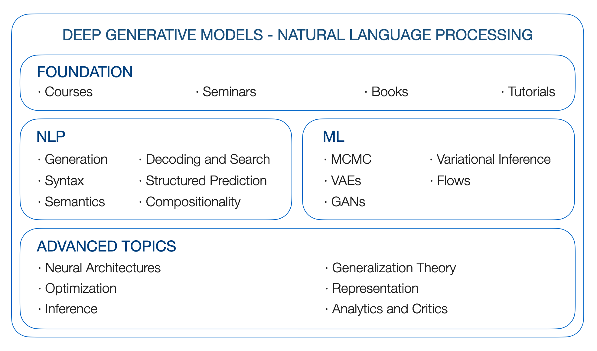

DGMs 4 NLP. Deep Generative Models for Natural Language Processing. A Roadmap. 

Yao Fu, University of Edinburgh, yao.fu@ed.ac.uk

\*\*Update\*\*: [Long-range Dependency]((#long-range-dependency)); [Why S4 is Good at Long Sequence: Remembering a Sequence with Online Function Approximation](https://yaofu.notion.site/Why-S4-is-Good-at-Long-Sequence-Remembering-a-Sequence-with-Online-Function-Approximation-836fc54a49aa413b84997a265132f13f)

\*\*Update\*\*: Randomization; Minimizing Expectations

\*\*TODO 1\*\*: Diffusion models; Relationship between inference and RL

\*\*TODO 2\*\*: Constrastive Learning; Prompting

\*\*TODO 3\*\*: Long-range transformers; Matrix Factorization and Word embedding

\*\*TODO 4\*\*: Efficient Inference; Kernels

----
## Introduction 

### Prelude

(written in early 2019, originated from the [DGM seminar at Columbia](http://stat.columbia.edu/~cunningham/teaching/GR8201/))

Why do we want deep generative models? Because we want to learn basic factors that generate language. Human language contains rich latent factors, the continuous ones might be emotion, intention, and others, the discrete/ structural factors might be POS/ NER tags or syntax trees. Many of them are latent as in most cases, we just observe the sentence. They are also generative: human should produce language based on the overall idea, the current emotion, the syntax, and all other things we can or cannot name. 

How to model the generative process of language in a statistically principled way? Can we have a flexible framework that allows us to incorporate explicit supervision signals when we have labels, or add distant supervision or logical/ statistical constraints when we do not have labels but have other prior knowledge, or simply infer whatever makes the most sense when we have no labels or a priori? Is it possible that we exploit the modeling power of advanced neural architectures while still being mathematical and probabilistic? DGMs allow us to achieve these goals. 

Let us begin the journey. 

### chronology
* 2013: VAE
* 2014: GAN; Sequence to sequence; Attention
* 2015: Normalizing Flow
* 2016: Gumbel-softmax
* 2017: Transformers
* 2018: BERT
* 2019: Probing and Bertology
* 2020: GPT3; Contrastive Learning; Robustness
* 2021: Prompts 

## Table of Content 



- [Introduction](#introduction)
  - [Prelude](#prelude)
  - [chronology](#chronology)
- [Table of Content](#table-of-content)
- [Resources](#resources)
  - [DGM Seminars](#dgm-seminars)
  - [Courses](#courses)
  - [Books](#books)
- [NLP Side](#nlp-side)
  - [Generation](#generation)
  - [Decoding and Search, General](#decoding-and-search-general)
  - [Constrained Decoding](#constrained-decoding)
  - [Non-autoregressive Decoding](#non-autoregressive-decoding)
  - [Decoding from Pretrained Language Model](#decoding-from-pretrained-language-model)
  - [Structured Prediction](#structured-prediction)
  - [Syntax](#syntax)
  - [Semantics](#semantics)
  - [Grammar Induction](#grammar-induction)
  - [Compositionality](#compositionality)
- [ML Side](#ml-side)
  - [Samplig Methods](#samplig-methods)
  - [Variational Inference, VI](#variational-inference-vi)
  - [VAEs](#vaes)
  - [Reparameterization](#reparameterization)
  - [GANs](#gans)
  - [Flows](#flows)
  - [Diffusion Models](#diffusion-models)
- [Advanced Topics](#advanced-topics)
  - [Neural Architectures](#neural-architectures)
    - [RNNs](#rnns)
    - [Transformers](#transformers)
    - [Language Model Pretraining](#language-model-pretraining)
    - [Neural Network Learnability](#neural-network-learnability)
    - [Long-range Dependency](#long-range-dependency)
  - [Optimization](#optimization)
    - [Gradient Estimation](#gradient-estimation)
    - [Discrete Structures](#discrete-structures)
  - [Inference](#inference)
    - [Efficient Inference](#efficient-inference)
    - [Posterior Regularization](#posterior-regularization)
  - [Randomization](#randomization)
  - [Generalization Thoery](#generalization-thoery)
  - [Representation](#representation)
    - [Information Theory](#information-theory)
    - [Disentanglement and Interpretability](#disentanglement-and-interpretability)
    - [Invariance](#invariance)
  - [Analysis and Critics](#analysis-and-critics)

Citation:
```
@article{yao2019DGM4NLP,
  title   = "Deep Generative Models for Natual Language Processing",
  author  = "Yao Fu",
  year    = "2019",
  url     = "https://github.com/FranxYao/Deep-Generative-Models-for-Natural-Language-Processing"
}
```

## Resources 

* [How to write Variational Inference and Generative Models for NLP: a recipe](https://github.com/FranxYao/Deep-Generative-Models-for-Natural-Language-Processing/blob/master/src/VI4NLP_Recipe.pdf). This is strongly suggested for beginners writing papers about VAEs for NLP.

* A Tutorial on Deep Latent Variable Models of Natural Language ([link](https://arxiv.org/abs/1812.06834)), EMNLP 18 
  * Yoon Kim, Sam Wiseman and Alexander M. Rush, Havard

* Latent Structure Models for NLP. ACL 2019 tutorial [link](https://deep-spin.github.io/tutorial/)
  * André Martinns, Tsvetomila Mihaylova, Nikita Nangia, Vlad Niculae.

### DGM Seminars

* Columbia STAT 8201, [Deep Generative Models](http://stat.columbia.edu/~cunningham/teaching/GR8201/), by [John Cunningham](https://stat.columbia.edu/~cunningham/)

* Stanford CS 236, [Deep Generative Models](https://deepgenerativemodels.github.io/), by Stefano Ermon

* U Toronto CS 2541 [Differentiable Inference and Generative Models](https://www.cs.toronto.edu/~duvenaud/courses/csc2541/index.html), CS 2547 [Learning Discrete Latent Structures](https://duvenaud.github.io/learn-discrete/), CSC 2547 Fall 2019: [Learning to Search](https://duvenaud.github.io/learning-to-search/). By David Duvenaud

* U Toronto STA 4273 Winter 2021: [Minimizing Expectations](https://www.cs.toronto.edu/~cmaddis/courses/sta4273_w21/). By Chris Maddison

* Berkeley CS294-158 [Deep Unsupervised Learning](https://sites.google.com/view/berkeley-cs294-158-sp20/home). By Pieter Abbeel

* Columbia STCS 8101 [Representation Learning: A Probabilistic Perspective](http://www.cs.columbia.edu/~blei/seminar/2020-representation/index.html). By David Blei

* Stanford CS324 - [Large Language Models](https://stanford-cs324.github.io/winter2022/). By Percy Liang, Tatsunori Hashimoto and Christopher Re

### Courses

The fundation of the DGMs is built upon probabilistic graphical models. So we take a look at the following resources

* Blei's Foundation of Graphical Models course, STAT 6701 at Columbia ([link](http://www.cs.columbia.edu/~blei/fogm/2019F/index.html))
  * Foundation of probabilistic modeling, graphical models, and approximate inference. 

* Xing's Probabilistic Graphical Models, 10-708 at CMU ([link](https://sailinglab.github.io/pgm-spring-2019/))
  * A really heavy course with extensive materials.
  * 5 modules in total: exact inference, approximate inference, DGMs, reinforcement learning, and non-parameterics. 
  * All the lecture notes, vedio recordings, and homeworks are open-sourced. 

*  Collins' Natural Language Processing, COMS 4995 at Columbia ([link](http://www.cs.columbia.edu/~mcollins/cs4705-spring2019/))
   * Many inference methods for structured models are introduced. Also take a look at related notes from [Collins' homepage](http://www.cs.columbia.edu/~mcollins/)
   * Also checkout [bilibili](https://www.bilibili.com/video/av29608234?from=search&seid=10252913399572988135)

### Books

* Pattern Recognition and Machine Learning. Christopher M. Bishop. 2006
  * Probabily the most classical textbook 
  * The _core part_, according to my own understanding, of this book, should be section 8 - 13, especially section 10 since this is the section that introduces variational inference. 

* Machine Learning: A Probabilistic Perspective. Kevin P. Murphy. 2012
  * Compared with the PRML Bishop book, this book may be used as a super-detailed handbook for various graphical models and inference methods. 

* Graphical Models, Exponential Families, and Variational Inference. 2008
  * Martin J. Wainwright and Michael I. Jordan

* Linguistic Structure Prediction. 2011
  * Noah Smith 

* The Syntactic Process. 2000 
  * Mark Steedman

----


## NLP Side 


### Generation

*  Generating Sentences from a Continuous Space, CoNLL 15
   * Samuel R. Bowman, Luke Vilnis, Oriol Vinyals, Andrew M. Dai, Rafal Jozefowicz, Samy Bengio

* Neural variational inference for text processing, ICML 16 
  * Yishu Miao, Lei Yu, Phil Blunsom, Deepmind

* Learning Neural Templates for Text Generation. EMNLP 2018 
  * Sam Wiseman, Stuart M. Shieber, Alexander Rush. Havard 

* Residual Energy Based Models for Text Generation. ICLR 20
  * Yuntian Deng, Anton Bakhtin, Myle Ott, Arthur Szlam, Marc' Aurelio Ranzato. Havard and FAIR

* Paraphrase Generation with Latent Bag of Words. NeurIPS 2019.
  * Yao Fu, Yansong Feng, and John P. Cunningham. Columbia 


### Decoding and Search, General

*  Fairseq Decoding Library. [[github](https://github.com/pytorch/fairseq/blob/master/fairseq/search.py)]

* Controllabel Neural Text Generation [[Lil'Log](https://lilianweng.github.io/lil-log/2021/01/02/controllable-neural-text-generation.html)]

* Best-First Beam Search. TACL 2020
  * Clara Meister, Tim Vieira, Ryan Cotterell

* The Curious Case of Neural Text Degeneration. ICLR 2020 
  * Ari Holtzman, Jan Buys, Li Du, Maxwell Forbes, Yejin Choi

* Comparison of Diverse Decoding Methods from Conditional Language Models. ACL 2019
  * Daphne Ippolito, Reno Kriz, Maria Kustikova, Joa ̃o Sedoc, Chris Callison-Burch

* Stochastic Beams and Where to Find Them: The Gumbel-Top-k Trick for Sampling Sequences Without Replacement. ICML 19
  * Wouter Kool, Herke van Hoof, Max Welling

* Conditional Poisson Stochastic Beam Search. EMNLP 2021
  * Clara Meister, Afra Amini, Tim Vieira, Ryan Cotterell

* Massive-scale Decoding for Text Generation using Lattices. 2021
  * Jiacheng Xu and Greg Durrett


### Constrained Decoding
* Lexically Constrained Decoding for Sequence Generation Using Grid Beam Search. ACL 2017
  * Chris Hokamp, Qun Liu

* Fast Lexically Constrained Decoding with Dynamic Beam Allocation for Neural Machine Translation. NAACL 2018 
  * Matt Post, David Vilar

* Improved Lexically Constrained Decoding for Translation and Monolingual Rewriting. NAACL 2019
  * J. Edward Hu, Huda Khayrallah, Ryan Culkin, Patrick Xia, Tongfei Chen, Matt Post, Benjamin Van Durme
  
* Towards Decoding as Continuous Optimisation in Neural Machine Translation. EMNLP 2017
  * Cong Duy Vu Hoang, Gholamreza Haffari and Trevor Cohn. 

* Gradient-guided Unsupervised Lexically Constrained Text Generation. EMNLP 2020
  * Lei Sha

* Controlled Text Generation as Continuous Optimization with Multiple Constraints. 2021 
  * Sachin Kumar, Eric Malmi, Aliaksei Severyn, Yulia Tsvetkov


### Non-autoregressive Decoding 

Note:  I have not fully gone through this chapter, please give me suggestions! 

* Non-Autoregressive Neural Machine Translation. ICLR 2018 
  * Jiatao Gu, James Bradbury, Caiming Xiong, Victor O.K. Li, Richard Socher

* Fully Non-autoregressive Neural Machine Translation: Tricks of the Trade. 
  * Jiatao Gu, Xiang Kong. 

* Fast Decoding in Sequence Models Using Discrete Latent Variables. ICML 2021
  * Łukasz Kaiser, Aurko Roy, Ashish Vaswani, Niki Parmar, Samy Bengio, Jakob Uszkoreit, Noam Shazeer

* Cascaded Text Generation with Markov Transformers. Arxiv 20
  * Yuntian Deng and Alexander Rush

* Glancing Transformer for Non-Autoregressive Neural Machine Translation. ACL 2021 
  * Lihua Qian, Hao Zhou, Yu Bao, Mingxuan Wang, Lin Qiu, Weinan Zhang, Yong Yu, Lei Li
  * This one is now deployed inside Bytedance


### Decoding from Pretrained Language Model 

TODO: more about it

* Prompt Papers, ThuNLP ([link](https://github.com/thunlp/PromptPapers))

* CTRL: A Conditional Transformer Language Model for Controllable Generation. Arxiv 2019
  * Nitish Shirish Keskar, Bryan McCann, Lav R. Varshney, Caiming Xiong, Richard Socher

* Plug and Play Language Models: a Simple Approach to Controlled Text Generation
  * Sumanth Dathathri, Andrea Madotto, Janice Lan, Jane Hung, Eric Frank, Piero Molino, Jason Yosinski, Rosanne Liu

### Structured Prediction

*  Torch-Struct: Deep Structured Prediction Library. [github](https://github.com/harvardnlp/pytorch-struct), [paper](https://arxiv.org/abs/2002.00876), [documentation](http://nlp.seas.harvard.edu/pytorch-struct/)
   * Alexander M. Rush. Cornell University 

*  An introduction to Conditional Random Fields. 2012 
   *  Charles Sutton and Andrew McCallum. 


*  Inside-Outside and Forward-Backward Algorithms Are Just Backprop. 2016. 
   *  Jason Eisner
* Learning with Fenchel-Young Losses. JMLR 2019 
  * Mathieu Blondel, André F. T. Martins, Vlad Niculae

*  Structured Attention Networks. ICLR 2017 
   * Yoon Kim, Carl Denton, Luong Hoang, Alexander M. Rush

* Differentiable Dynamic Programming for Structured Prediction and Attention. ICML 2018 
  * Arthur Mensch and Mathieu Blondel.


### Syntax

* Recurrent Neural Network Grammars. NAACL 16
  * Chris Dyer, Adhiguna Kuncoro, Miguel Ballesteros, and Noah Smith.

* Unsupervised Recurrent Neural Network Grammars, NAACL 19 
  * Yoon Kin, Alexander Rush, Lei Yu, Adhiguna Kuncoro, Chris Dyer, and Gabor Melis

* Differentiable Perturb-and-Parse: Semi-Supervised Parsing with a Structured Variational Autoencoder, ICLR 19
  * Caio Corro, Ivan Titov, Edinburgh


### Semantics

* The Syntactic Process. 2020 
  * Mark Steedman

* Linguistically-Informed Self-Attention for Semantic Role Labeling. EMNLP 2018 Best paper award
  * Emma Strubell, Patrick Verga, Daniel Andor, David Weiss and Andrew McCallum. UMass Amherst and Google AI Language

* Semantic Parsing with Semi-Supervised Sequential Autoencoders. 2016
  * Tomas Kocisky, Gabor Melis, Edward Grefenstette, Chris Dyer, Wang Ling, Phil Blunsom, Karl Moritz Hermann

### Grammar Induction 
* Grammar Induction and Unsupervised Learning, paper list. ([link](https://github.com/FranxYao/nlp-fundamental-frontier/blob/main/nlp/grammar_induction.md))
  * Yao Fu 

### Compositionality

* [Compositional Generalization in NLP](https://github.com/FranxYao/CompositionalGeneralizationNLP). Paper list
  * Yao Fu

* Generalization without Systematicity: On the Compositional Skills of Sequence-to-Sequence Recurrent Networks. ICML 2019
  * Brenden Lake and Marco Baroni 

* Improving Text-to-SQL Evaluation Methodology. ACL 2018 
  * Catherine Finegan-Dollak, Jonathan K. Kummerfeld, Li Zhang, Karthik Ramanathan, Sesh Sadasivam, Rui Zhang, Dragomir Radev

----

## ML Side 


### Samplig Methods

*  Probabilistic inference using Markov chain Monte Carlo methods. 1993 
   * Radford M Neal 

* Elements of Sequential Monte Carlo ([link](https://arxiv.org/abs/1903.04797))
  * Christian A. Naesseth, Fredrik Lindsten, Thomas B. Schön

* A Conceptual Introduction to Hamiltonian Monte Carlo ([link](https://arxiv.org/abs/1701.02434))
  * Michael Betancourt

* Candidate Sampling ([link](https://www.tensorflow.org/extras/candidate_sampling.pdf))
  * Google Tensorflow Blog

* Noise-constrastive estimation: A new estimation principle for unnormalized statistical models. AISTATA 2010 
  * Michael Gutmann, Hyvarinen. University of Helsinki

*  A* Sampling. NIPS 2014 Best paper award
   * Chris J. Maddison, Daniel Tarlow, Tom Minka. University of Toronto and MSR


### Variational Inference, VI 

*  Cambridge Variational Inference Reading Group ([link](http://www.statslab.cam.ac.uk/~sp825/vi.html))
   * Sam Power. University of Cambridge 

*  Variational Inference: A Review for Statisticians. 
   * David M. Blei, Alp Kucukelbir, Jon D. McAuliffe. 

* Stochastic Variational Inference
  * Matthew D. Hoffman, David M. Blei, Chong Wang, John Paisley

* Variational Bayesian Inference with Stochastic Search. ICML 12
  * John Paisley, David Blei, Michael Jordan. Berkeley and Princeton 


### VAEs 

*  Auto-Encoding Variational Bayes, ICLR 14
   * Diederik P. Kingma, Max Welling

* beta-VAE: Learning Basic Visual Concepts with a Constrained Variational Framework. ICLR 2017
  * Irina Higgins, Loic Matthey, Arka Pal, Christopher Burgess, Xavier Glorot, Matthew Botvinick, Shakir Mohamed, Alexander Lerchner

* Importance Weighted Autoencoders. ICLR 2015 
  * Yuri Burda, Roger Grosse, Ruslan Salakhutdinov

* Stochastic Backpropagation and Approximate Inference in Deep Generative Models. ICML 14
  * Danilo Jimenez Rezende, Shakir Mohamed, Daan Wierstra
  * Reparameterization w. deep gaussian models. 

* Semi-amortized variational autoencoders, ICML 18 
  * Yoon Kim, Sam Wiseman, Andrew C. Miller, David Sontag, Alexander M. Rush, Havard

* Adversarially Regularized Autoencoders, ICML 18 
  * Jake (Junbo) Zhao, Yoon Kim, Kelly Zhang, Alexander M. Rush, Yann LeCun. 


### Reparameterization 
More on reparameterization: to reparameterize gaussian mixture, permutation matrix, and rejection samplers(Gamma and Dirichlet).   

* Stochastic Backpropagation through Mixture Density Distributions, Arxiv 16
  * Alex Graves

* Reparameterization Gradients through Acceptance-Rejection Sampling Algorithms. AISTATS 2017 
  * Christian A. Naesseth, Francisco J. R. Ruiz, Scott W. Linderman, David M. Blei

* Implicit Reparameterization Gradients. NeurIPS 2018. 
  * Michael Figurnov, Shakir Mohamed, and Andriy Mnih

* Categorical Reparameterization with Gumbel-Softmax. ICLR 2017 
  * Eric Jang, Shixiang Gu, Ben Poole

*  The Concrete Distribution: A Continuous Relaxation of Discrete Random Variables. ICLR 2017 
   * Chris J. Maddison, Andriy Mnih, and Yee Whye Teh

* Invertible Gaussian Reparameterization:  Revisiting the Gumbel-Softmax. 2020
  *  Andres Potapczynski, Gabriel Loaiza-Ganem, John P. Cunningham 

* Reparameterizable Subset Sampling via Continuous Relaxations. IJCAI 2019 
  * Sang Michael Xie and Stefano Ermon


### GANs

* Generative Adversarial Networks, NIPS 14
  * Ian J. Goodfellow, Jean Pouget-Abadie, Mehdi Mirza, Bing Xu, David Warde-Farley, Sherjil Ozair, Aaron Courville, Yoshua Bengio

* Towards principled methods for training generative adversarial networks, ICLR 2017 
  * Martin Arjovsky and Leon Bottou

*  Wasserstein GAN 
   * Martin Arjovsky, Soumith Chintala, Léon Bottou

* InfoGAN: Interpretable Representation Learning by Information Maximizing Generative Adversarial Nets. NIPS 2016
  * Xi Chen, Yan Duan, Rein Houthooft, John Schulman, Ilya Sutskever, Pieter Abbeel. UC Berkeley. OpenAI


### Flows

*  Flow Based Deep Generative Models, from [Lil's log](https://lilianweng.github.io/lil-log/2018/10/13/flow-based-deep-generative-models.html) 

* Variational Inference with Normalizing Flows, ICML 15 
  * Danilo Jimenez Rezende, Shakir Mohamed

* Improved Variational Inference with Inverse Autoregressive Flow
  * Diederik P Kingma, Tim Salimans, Rafal Jozefowicz, Xi Chen, Ilya Sutskever, Max Welling

* Density estimation using Real NVP. ICLR 17 
  * Laurent Dinh, Jascha Sohl-Dickstein, Samy Bengio

* Learning About Language with Normalizing Flows 
  * Graham Neubig, CMU, [slides](http://www.phontron.com/slides/neubig19generative.pdf)

* Latent Normalizing Flows for Discrete Sequences. ICML 2019. 
  * Zachary M. Ziegler and Alexander M. Rush

* Discrete Flows: Invertible Generative Models of Discrete Data. 2019 
  * Dustin Tran, Keyon Vafa, Kumar Krishna Agrawal, Laurent Dinh, Ben Poole

* Variational Neural Machine Translation with Normalizing Flows. ACL 2020 
  * Hendra Setiawan, Matthias Sperber, Udhay Nallasamy, Matthias Paulik. Apple 

* On the Sentence Embeddings from Pre-trained Language Models. EMNLP 2020 
  * Bohan Li, Hao Zhou, Junxian He, Mingxuan Wang, Yiming Yang, Lei Li

### Diffusion Models 

* [What are Diffusion Models?](https://lilianweng.github.io/lil-log/2021/07/11/diffusion-models.html) 2021
  * Lilian Weng

* [Generative Modeling by Estimating Gradients of the Data Distribution](https://yang-song.github.io/blog/2021/score/). 2021
  * Yang Song


----
## Advanced Topics

### Neural Architectures


#### RNNs

* Ordered Neurons: Integrating Tree Structured into Recurrent Neural Networks
  * Yikang Shen, Shawn Tan, Alessandro Sordoni, Aaron Courville. Mila, MSR

* RNNs can generate bounded hierarchical languages with optimal memory
  * John Hewitt, Michael Hahn, Surya Ganguli, Percy Liang, Christopher D. Manning

#### Transformers

* Analyzing Multi-Head Self-Attention: Specialized Heads Do the Heavy Lifting, the Rest Can Be Pruned. ACL 2019
  * Elena Voita, David Talbot, Fedor Moiseev, Rico Sennrich, Ivan Titov

* Theoretical Limitations of Self-Attention in Neural Sequence Models. TACL 2019
  * Michael Hahn

* Rethinking Attention with Performers. 2020
  * Krzysztof Choromanski, Valerii Likhosherstov, David Dohan, Xingyou Song, Andreea Gane, Tamas Sarlos, Peter Hawkins, Jared Davis, Afroz Mohiuddin, Lukasz Kaiser, David Belanger, Lucy Colwell, Adrian Weller

#### Language Model Pretraining

* THUNLP: Pre-trained Languge Model paper list ([link](https://github.com/thunlp/PLMpapers))
  * Xiaozhi Wang and Zhengyan Zhang, Tsinghua University 

#### Neural Network Learnability
* [Neural Network Learnability](https://github.com/FranxYao/Semantics-and-Compositional-Generalization-in-Natural-Language-Processing#neural-network-learnability). Yao Fu


#### Long-range Dependency 

* Long Range Arena: A Benchmark for Efficient Transformers
  * Yi Tay, Mostafa Dehghani, Samira Abnar, Yikang Shen, Dara Bahri, Philip Pham, Jinfeng Rao, Liu Yang, Sebastian Ruder, Donald Metzler

* HiPPO: Recurrent Memory with Optimal Polynomial Projections. NeurIPS 2020
  * Albert Gu, Tri Dao, Stefano Ermon, Atri Rudra, Christopher Ré 
  
* Combining Recurrent, Convolutional, and Continuous-time Models with the Linear State Space Layer. NeurIPS 2021
  * Albert Gu, Isys Johnson, Karan Goel, Khaled Saab, Tri Dao, Atri Rudra, Christopher Ré

* Efficiently Modeling Long Sequences with Structured State Spaces. ICLR 2022
  * Albert Gu, Karan Goel, and Christopher Ré 

* [Why S4 is Good at Long Sequence: Remembering a Sequence with Online Function Approximation.](https://yaofu.notion.site/Why-S4-is-Good-at-Long-Sequence-Remembering-a-Sequence-with-Online-Function-Approximation-836fc54a49aa413b84997a265132f13f) 2022
  * Yao Fu

### Optimization

#### Gradient Estimation

* [Minimizing Expectations](https://www.cs.toronto.edu/~cmaddis/courses/sta4273_w21/). Chris Maddison

*  Monte Carlo Gradient Estimation in Machine Learning 
   * Schakir Mohamed, Mihaela Rosca, Michael Figurnov, Andriy Mnih. DeepMind

* Variational Inference for Monte Carlo Objectives. ICML 16
  * Andriy Mnih,  Danilo J. Rezende. DeepMind

* REBAR: Low-variance, unbiased gradient estimates for discrete latent variable models. NIPS 17
  * George Tucker, Andriy Mnih, Chris J. Maddison, Dieterich Lawson, Jascha Sohl-Dickstein. Google Brain, DeepMind, Oxford

*  Backpropagation Through the Void: Optimizing Control Variates for Black-box Gradient Estimation. ICLR 18
   * Will Grathwohl, Dami Choi, Yuhuai Wu, Geoffrey Roeder, David Duvenaud. U Toronto and Vector Institute
  
* Backpropagating through Structured Argmax using a SPIGOT. ACL 2018 Best Paper Honorable Mention. 
  * Hao Peng, Sam Thomson, and Noah A. Smith
  
* Understanding the Mechanics of SPIGOT: Surrogate Gradients for Latent Structure Learning. EMNLP 2020 
  * Tsvetomila Mihaylova, Vlad Niculae, and Andre ́ F. T. Martins


#### Discrete Structures

* Learning with Differentiable Perturbed Optimizers. NeurIPS 2020
  * Quentin Berthet, Mathieu Blondel, Olivier Teboul, Marco Cuturi, Jean-Philippe Vert, Francis Bach

* Gradient Estimation with Stochastic Softmax Tricks. NeurIPS 2020 
  * Max B. Paulus, Dami Choi, Daniel Tarlow, Andreas Krause, Chris J. Maddison. 

* Differentiable Dynamic Programming for Structured Prediction and Attention. ICML 18 
  * Arthur Mensch, Mathieu Blondel. Inria Parietal and NTT Communication Science Laboratories 

* Stochastic Optimization of Sorting Networks via Continuous Relaxations
  * Aditya Grover, Eric Wang, Aaron Zweig, Stefano Ermon

* Differentiable Ranks and Sorting using Optimal Transport
  * Guy Lorberbom, Andreea Gane, Tommi Jaakkola, and Tamir Hazan

* Reparameterizing the Birkhoff Polytope for Variational Permutation Inference. AISTATS 2018 
  * Scott W. Linderman, Gonzalo E. Mena, Hal Cooper, Liam Paninski, John P. Cunningham. 

* A Regularized Framework for Sparse and Structured Neural Attention. NeurIPS 2017

* SparseMAP: Differentiable Sparse Structured Inference. ICML 2018


### Inference

* Topics in Advanced Inference. Yingzhen Li. ([Link](http://yingzhenli.net/home/pdf/topics_approx_infer.pdf))

#### Efficient Inference

* Nested Named Entity Recognition with Partially-Observed TreeCRFs. AAAI 2021
  * Yao Fu, Chuanqi Tan, Mosha Chen, Songfang Huang, Fei Huang

* Rao-Blackwellized Stochastic Gradients for Discrete Distributions. ICML 2019.
  * Runjing Liu, Jeffrey Regier, Nilesh Tripuraneni, Michael I. Jordan, Jon McAuliffe

* Efficient Marginalization of Discrete and Structured Latent Variables via Sparsity. NeurIPS 2020 
  * Gonçalo M. Correia, Vlad Niculae, Wilker Aziz, André F. T. Martins


#### Posterior Regularization 

* Posterior Regularization for Structured Latent Variable Models. JMLR 2010
  * Kuzman Ganchev, João Graça, Jennifer Gillenwater, Ben Taskar. 

* Posterior Control of Blackbox Generation. 2019
  * Xiang Lisa Li and Alexander M. Rush. 

* Dependency Grammar Induction with a Neural Variational Transition-based Parser. AAAI 2019
  * Bowen Li, Jianpeng Cheng, Yang Liu, Frank Keller

### Randomization 
* Finding structure with randomness: Probabilistic algorithms for constructing approximate matrix decompositions. SIAM 2011
  * Nathan Halko, Per-Gunnar Martinsson, Joel A. Tropp

* Efficient optimization of loops and limits with randomized telescoping sums. ICML 2019
  * Alex Beatson, Ryan P Adams 

* Telescoping Density-Ratio Estimation. NeurIPS 2020
  * Benjamin Rhodes, Kai Xu, Michael U. Gutmann

* Bias-Free Scalable Gaussian Processes via Randomized Truncations. ICML 2021
  * Andres Potapczynski, Luhuan Wu, Dan Biderman, Geoff Pleiss, John P Cunningham 

* Randomized Automatic Differentiation. ICLR 2021
  * Deniz Oktay, Nick McGreivy, Joshua Aduol, Alex Beatson, Ryan P. Adams

* Scaling Structured Inference with Randomization. 2021
  * Yao Fu, John Cunningham, Mirella Lapata


### Generalization Thoery

* CS229T. Statistical Learning Theory. 2016
  * Percy Liang 


### Representation

#### Information Theory 

* Elements of Information Theory. Cover and Thomas. 1991 

* On Variational Bounds of Mutual Information. ICML 2019 
  * Ben Poole, Sherjil Ozair, Aaron van den Oord, Alexander A. Alemi, George Tucker
  * A comprehensive discussion of all these MI variational bounds 

* Learning Deep Representations By Mutual Information Estimation And Maximization. ICLR 2019 
  * R Devon Hjelm, Alex Fedorov, Samuel Lavoie-Marchildon, Karan Grewal, Phil Bachman, Adam Trischler, and Yoshua Bengio
  * A detailed comparison between different MI estimators, section 3.2. 

* MINE: Mutual Information Neural Estimation
  * R Devon Hjelm, Alex Fedorov, Samuel Lavoie-Marchildon, Karan Grewal, Phil Bachman, Adam Trischler, Yoshua Bengio

* Deep Variational Information Bottleneck. ICLR 2017 
  * Alexander A. Alemi, Ian Fischer, Joshua V. Dillon, Kevin Murphy. Google Research 


#### Disentanglement and Interpretability

* Identifying Bayesian Mixture Models 
  * Michael Betancourt

* Disentangling Disentanglement in Variational Autoencoders. ICML 2019 
  * Emile Mathieu, Tom Rainforth, N. Siddharth, Yee Whye Teh

* Challenging Common Assumptions in the Unsupervised Learning of Disentangled Representations. ICML 2019 
  * Francesco Locatello, Stefan Bauer, Mario Lucic, Gunnar Rätsch, Sylvain Gelly, Bernhard Schölkopf, Olivier Bachem


#### Invariance

* Emergence of Invariance and Disentanglement in Deep Representations
  * Alessandro Achillo and Stefano Soatto. UCLA. JMLR 2018 

* Invariant Risk Minimization
  * Martin Arjovsky, Leon Bottou, Ishaan Gulrajani, David Lopez-Paz. 2019. 


### Analysis and Critics

* Fixing a Broken ELBO. ICML 2018. 
  * Alexander A. Alemi, Ben Poole, Ian Fischer, Joshua V. Dillon, Rif A. Saurous, Kevin Murphy

* Tighter Variational Bounds are Not Necessarily Better. ICML 2018 
  * Tom Rainforth, Adam R. Kosiorek, Tuan Anh Le, Chris J. Maddison, Maximilian Igl, Frank Wood, Yee Whye Teh

* The continuous Bernoulli: fixing a pervasive error in variational autoencoders. NeurIPS 2019 
  * Gabriel Loaiza-Ganem and John P. Cunningham. Columbia. 

* Do Deep Generative Models Know What They Don't Know? ICLR 2019 
  * Eric Nalisnick, Akihiro Matsukawa, Yee Whye Teh, Dilan Gorur, Balaji Lakshminarayanan

* Effective Estimation of Deep Generative Language Models. ACL 2020 
  * Tom Pelsmaeker and Wilker Aziz. University of Edinburgh and University of Amsterdam 

* How Good is the Bayes Posterior in Deep Neural Networks Really? ICML 2020 
  * Florian Wenzel, Kevin Roth, Bastiaan S. Veeling, Jakub Świątkowski, Linh Tran, Stephan Mandt, Jasper Snoek, Tim Salimans, Rodolphe Jenatton, Sebastian Nowozin

* A statistical theory of cold posteriors in deep neural networks. ICLR 2021 
  * Laurence Aitchison


